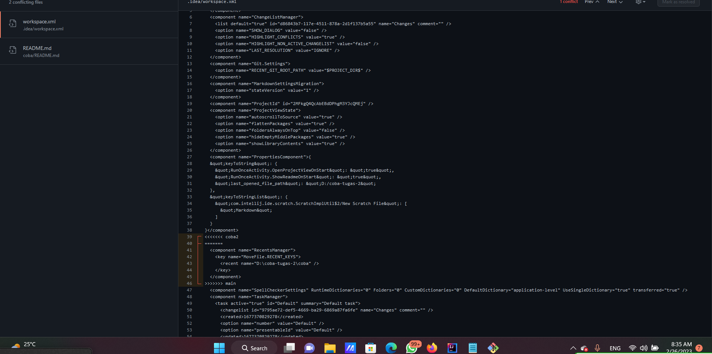

# Penjelasan dari screenshot
___
## Soal Prioritas 1
### Screenshot 1

Merupakan screenshot pembuatan repository pada github.

### Screenshot 2

Merupakan pembuatan folder section 1 sampai 8 yang kemudian di commit ke github.

### Screenshot 3

Merupakan pembuatan file dan folder yang ada dalam folder section. Diantaranya yaitu folder praktikum, folder, screenshoot, dan file README.md.

## Soal Prioritas 2

### Screenshot 4 

Setelah membuat branch baru kemudian saya melakukan perubahan pada section 2 yang nantinya saya push ke brach baru, kemudian saya lakukan pull request.

## Soal Eksplorasi

### Membuat trunkbase

Pada gambar tersebut dapat diambil sebuah kesimpulan yaitu, setelah melakukan perubahan kemudian saya melakukan push ke branch yang namanya BranchBaru kemudian saya melakukan pull request ke master.

### Management konflik pada github

Terdapat 2 branch baru yaitu branch coba dan coba2, kedua branch tersebut sama-sama mengerjakan file README.md. Pada saat melakukan push di masing-masing branch dan melakukan pull request di branch main maka terjadi konflik karena dua branch tersebut mengerjakan file yang sama, dan terdapat perbedaan pada baris yang dikerjakan pada masing-masing branch. Dapat dilihat pada gambar dibawah,

Selanjutnya dilakukan resolve program dengan cara berikut, Dengan cara memilih dan menghilangkan code yang tidak diperlukan.

Setelah di resolve maka dapat dilakukan pull request.

### Review Code

Dalam hal ini dilakukan review pada code yang telah dikerjakan, contohnya pada gambar di bawah ini,

